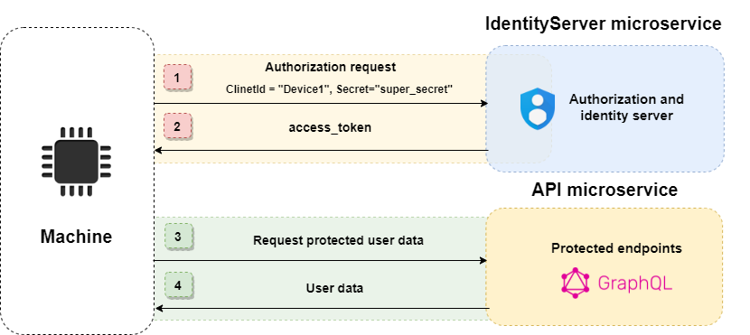

## Authentication machine-to-machine using Client Credentials flow

Client Credentials flow is the simplest and most direct form of authentication. It is recommended for server-side machine-to-machine communication where no users are involved and `acces_token` can be stored securely.

For example, we can think of a client as a machine. The client makes the first call with the correct  `ClientId` and `Secret`. This is the minimum needed to get an `access_token` directly fromthe IdentityServer. 



This flow is also often used by the application itself to avoid calls between services, the creation of a specific user to authenticate. So it can be interpreted as a deamon or Internall Agent.

**Flow step:**

1) The client (App) which wanna access makes a call to the token server and request `access_token` with its `clientId` and `Secret`.
    - The token server validates the `clientId` and `Secret`.
2) The token server returns an `access_token` with optional details about the scopes and expiryTime
3) The client (APP) passes the `access_token` it has just obtained in an Authorization header when making a request for the protected resource.
    - The API picks up the `access_token` passed in the Header and validates it.
4) If the validation is success, the API allows the request to access its resource, else returns a 401 UnAuthorized response.

> &#10240;
> **NOTE:** This flow require that `access_tokens` are stored safe and in this case `machine` prottects it well. 
> &#10240;

Identity server `Client credential flow` client definition:

```c#
new Client
{
    ClientId = "machine",

    ClientSecrets = { new Secret("secret".Sha256())},

    ClientName = "Some machine or server using clinet credentials",

    AllowedGrantTypes = GrantTypes.ClientCredentials,

    AllowedScopes = { "api" }
}
```

> &#10240;
> **NOTE:** The client credentials flow never has a user context, so you can not request OpenID scopes.
> &#10240;

### Using IdentityModel 

To interact with *IdetityServer* from custom clients and applications, you can use the [IdentityModel](https://github.com/IdentityModel/IdentityModel) lib. It is maintained by the same authors as duende *IdentityServer* and helps you interact with *OpenId Connect* and *Oauth* endpoints.

#### Most common

This are minimal APIs to help you:

##### Handle Discovery endpoint

`GetDiscoveryDocumentAsync(...)` helps you process requests to the identity server discovery endpoint, where the server publishes its metadata.

```c#
    var client = new HttpClient();
    string authority = "https://localhost:5001/"
    var disco = await client.GetDiscoveryDocumentAsync(authority);
    if (disco.IsError){
         /* Handle error */ 
        System.Console.WriteLine(disco.Error);
    }
```

##### Handle Token endpoint

`RequestClientCredentialsTokenAsync(...)` helps you request tokens from the token endpoint of a concrete server.

```c#
var client = new HttpClient();
var response = await client.RequestClientCredentialsTokenAsync(new ClientCredentialsTokenRequest
{
    Address = "https://localhost:5001/connect/token",

    ClientId = "client",
    ClientSecret = "secret",
    Scope = "api1"
});
```

#### IdentityModel for workers and web

The above APIs can help with direct interaction with *IdentityServer*. They are low-level and not very comprehensive and if you are developing an application, you will need to control the whole process as checking if the `access_token` has not expired etc..

This library should help you with:
- automatic renew of expired access tokens
- caching abstraction for access tokens 
- token lifetime automation for HttpClient

**How does it works?**. The library registers `HttpClinet` and wraps it with a custom handler that check if `access_token` exists. If the token has not yet been requested, the library calls the token endpoint and requests the new `access_token`. The returned token is used to process the request and the token is stored in the `InMemoryCache` and managed by the IdentityModel abstraction.

When a new request is triggered, IdentityModel knows if the token has expired or returned an unauthorised response if the token has been removed (revocate). If so, it requests a new token from the token endpoint.

This way, you do not have to write the entire flow yourself. But you need to configure it exactly and understand the IdentityModel API.

**API hit with requesting the token (first request)**


**API hit with cache token managment**


##### Setup Token managment

The most basic setup may be done by extension method:

```c#
public static partial class ServiceExtension {

    // This is your API base addres (You probably wanna move this under Configuration)
    private const string BaseAPIAddress = "https://localhost:5022/api/";

    public static IServiceCollection AddTokenManagment(this IServiceCollection services) {


        services.AddClientAccessTokenManagement(options =>
        {
            options.Clients.Add("identityserver", new ClientCredentialsTokenRequest
            {
                Address = "https://localhost:5001/connect/token",
                ClientId = "device",
                ClientSecret = "secret",
                Scope = "api"
            });

        });

        services.AddClientAccessTokenHttpClient("test_auth_client", configureClient: client =>
        {
            client.BaseAddress = new Uri(BaseAPIAddress);
        });

        return services;
    }
}

```

Then you can request concrete clinet from your code using `HttpClientFactory`

```c#
public async Task<Trigger_AuthorisedPayload> Handle(Trigger_Authorised request, CancellationToken cancellationToken) {

    var client = _clientFactory.CreateClient("test_auth_client");

    var client_response = await client.GetAsync("TestAuth/TestClientCredentials", cancellationToken);

    if(client_response.IsSuccessStatusCode ){
        var response = Trigger_AuthorisedPayload.Success();
        return response;
    }else{
        var response = Trigger_AuthorisedPayload.Error(new InternalServerError(
            string.Format("Failed to process api call status code: {0}",client_response.StatusCode)));
        
        return response;
    }
}
```

The demo contains an example of `client-credential-flow` under the directory `src/Device`.

This project contains a separate application with a test front-end where you can press keys and call the API with/without valid `access_token` and token management.

To run this demo, make sure all other applications are running!

- `/src/APIServer/API/` then run `dotnet watch run`
- `/src/BFF/API/` then run `dotnet watch run`
- `/src/IdentityServer/API/` then run `dotnet watch run`
- `/src/Device/API/` then run `dotnet watch run`

</br>


